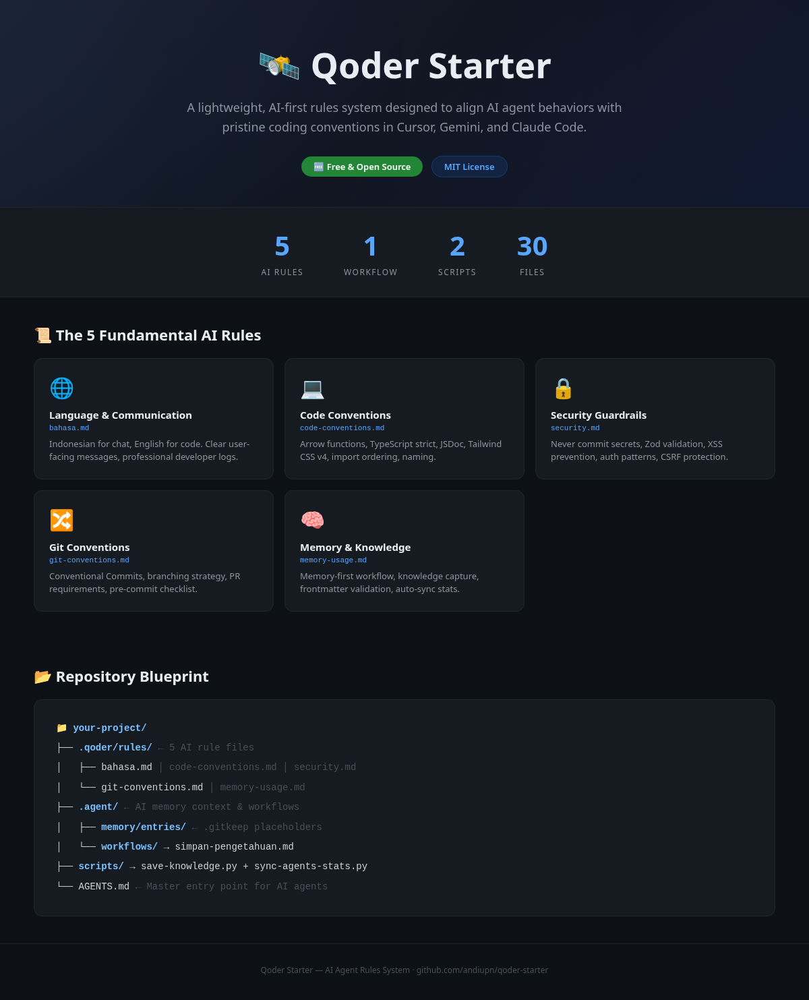
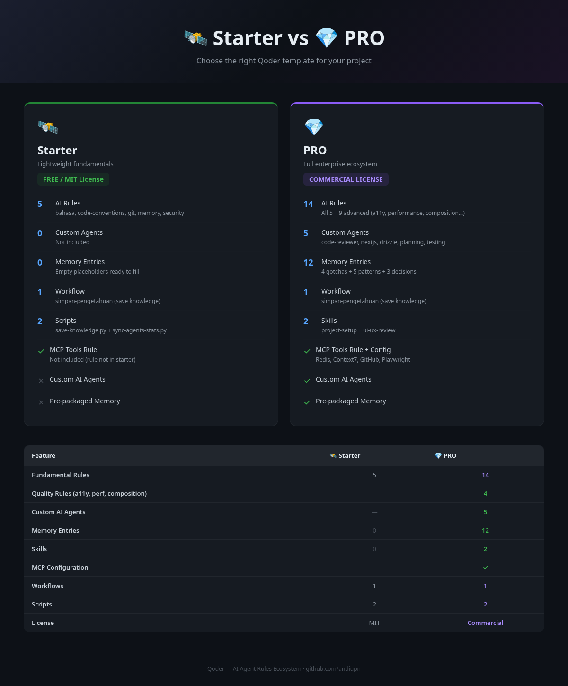
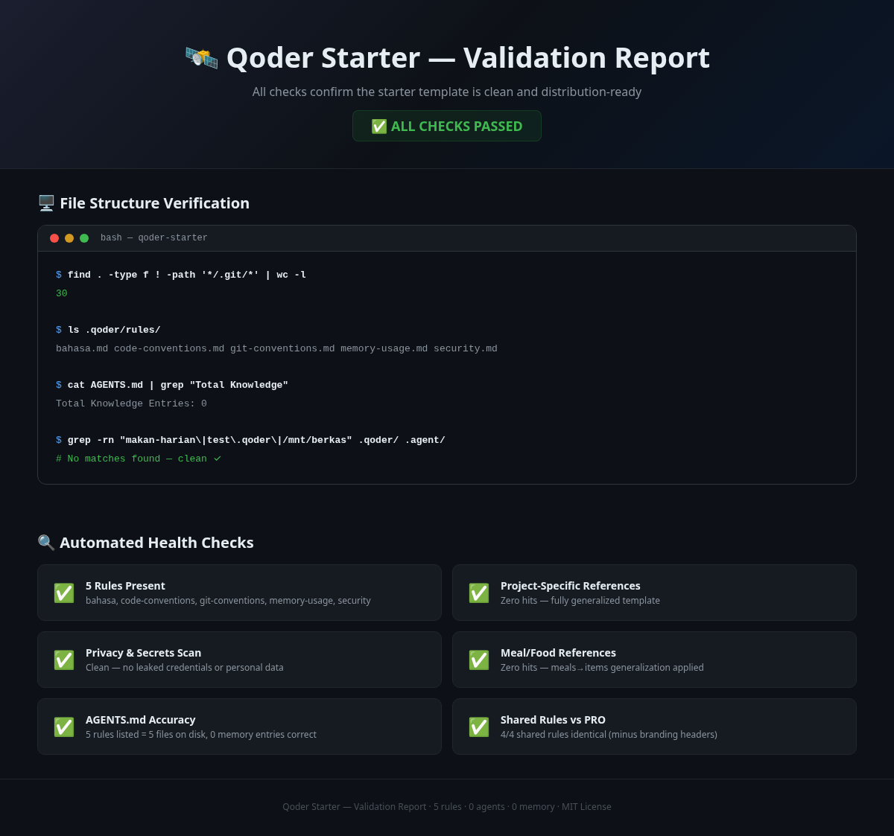

#Przystawka Qoder 🛰️

  <a href="README.md">English</a> | <a href="README.id.md">Bahasa Indonesia</a> | <a href="README.zh.md">简体中文</a> | <a href="README.hi.md">हिन्दी</a> | <a href="README.fr-ca.md">Français (CA)</a> | <a href="README.de.md">Deutsch</a> | <a href="README.fr.md">Français</a> | <a href="README.pt-br.md">Português (BR)</a> | <a href="README.vi.md">Tiếng Việt</a> | <strong>Polski</strong> | <a href="README.ja.md">日本語</a> | <a href="README.ko.md">한국어</a> | <a href="README.es.md">Español</a> | <a href="README.tr.md">Türkçe</a> | <a href="README.it.md">Italiano</a> | <a href="README.ru.md">Русский</a> | <a href="README.uk.md">Українська</a> | <a href="README.nl.md">Nederlands</a> | <a href="README.sv.md">Svenska</a> | <a href="README.ro.md">Română</a>

 

  <h3><strong>Agent AI bez reguł to po prostu chaotyczny skrypt.</strong></h3>
  
<strong>Qoder Starter to lekki system reguł oparty na sztucznej inteligencji, zaprojektowany w celu dostosowania zachowań agentów AI do nieskazitelnych konwencji kodowania w Cursor, Gemini i Claude Code.</strong>

  
Przestań marnować tokeny, cierpieć na halucynacje AI i zmagać się z niespójnymi stylami kodu. Natychmiast wzmocnij swojego asystenta kodowania 5 arkuszami podstawowych zasad.

> 📦 Darmowy szablon autorstwa **andiupn** ([kuncimu.com](https://kuncimu.com)) · Licencja na podstawie [Licencja MIT](LICENSE)  
> ☕ Jeśli to przydatne, [kup mi kawę](https://ko-fi.com/andiupn) · 🚀 Potrzebujesz zaawansowanych repozytoriów mono, niestandardowych agentów i wstępnie spakowanej pamięci? Wypróbuj [wersję PRO](https://github.com/sponsors/andiupn?frequency=monthly)

__ODZNACZKA_0__
__ODZNACZKA_1__
__ODZNACZKA_2__
__ODZNACZKA_3__
__ODZNACZKA_4__
__ODZNACZKA_5__

---

## 💡 Problem: chaos asystentów kodu AI
Asystenci AI są niesamowicie szybcy. Jednak bez wstępnie skonfigurowanych wytycznych piszą nieustrukturyzowany kod, ignorują konwencje nazewnictwa, ujawniają tajemnice i wykonują błędne zatwierdzenia git, które psują historię repozytorium.

---

## ⚡ Rozwiązanie: 5 podstawowych zasad sztucznej inteligencji

### 1. 📜 Konwencje dotyczące kodu i języka
Zachowuje przejrzystość języka (`bahasa.md`: indonezyjski dla czatu, angielski dla kodu) i wymusza standardowe formatowanie (`code-conventions.md`: funkcje strzałkowe, ścisły TypeScript, JSDoc).

### 🔒 2. Bezpieczeństwo bez halucynacji
Chroni klucze i dane uwierzytelniające API, wymuszając sprawdzanie poprawności danych (Zod) i reguły zapobiegania XSS (`security.md`) przed napisaniem jakiegokolwiek kodu.

### 🧠 3. System wiedzy historycznej
Konfiguruje wytyczne dotyczące pamięci (`memory-usage.md`) i konwencje git (`git-conventions.md`), aby agent AI uczył się na podstawie historii repozytorium, używając `/skills` do zapisywania odkryć sesji.

---

## 📊 LITE kontra PRO: Aktualizacja Premium

| Co dostajesz | 🆓 LITE (Rozrusznik) | 💎 PRO (Premium) |
|---|:---:|:---:|
| **Podstawowe zasady** | 5 | 14 (dodaje: obsługę błędów, testowanie, stos, a11y itp.) |
| **Wyspecjalizowani agenci celni** | ❌ | 5 (`code-reviewer`, `nextjs-specialist` itd.) |
| **Wpisy w pamięci (ogólne nasiona)** | ❌ | 12 (poprawki konfiguracji Next.js, Playwright, Redis) |
| **Konfiguracje DevOps i MCP** | ❌ | ✅ (szablony `mcp.json`) |
| **Aktualizacje nadrzędne** | Przez GitHuba | Za pośrednictwem [Sponsorów GitHub](https://github.com/sponsors/andiupn?frequency=monthly) |

👉 **[Wyświetl pełny przewodnik porównania i aktualizacji](COMPARISON.md)**

---

## 📂 Plan repozytorium

__KOD_BLOKU_0__

---

## 🖼️ Podgląd

  

  

  

---

## 🚀 Zacznij w 3 krokach

### 1. Skopiuj konfiguracje:
Skopiuj `.qoder/`, `.agent/`, `scripts/` i `AGENTS.md` do katalogu głównego projektu.

### 2. Skonfiguruj środowisko:

__KOD_BLOKU_1__

### 3. Rozpocznij kodowanie:
Otwórz projekt w Kursorze lub uruchom Claude Code. Agent AI automatycznie przeczyta zasady!

---

## 💖 Wesprzyj ten projekt (darowizny)

Jeśli ten szablon przyspieszył Twój proces kodowania, rozważ wsparcie:
- **Ko-fi:** [ko-fi.com/andiupn](https://ko-fi.com/andiupn)
– **Patreon:** [patreon.com/AndiUpn](https://patreon.com/AndiUpn)
- **Trakteer:** [trakteer.id/andi_upn/gift](https://trakteer.id/andi_upn/gift)
- **Saweria:** [saweria.co/andiupn](https://saweria.co/andiupn)

---

## 📄 Licencja

Ten projekt jest objęty licencją **Licencji MIT**. Więcej informacji znajdziesz w pliku [LICENCJA](LICENSE).